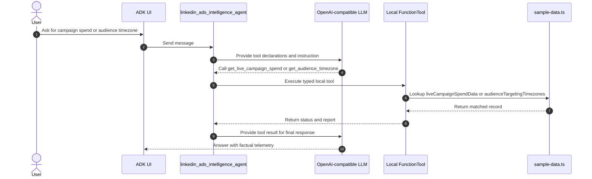
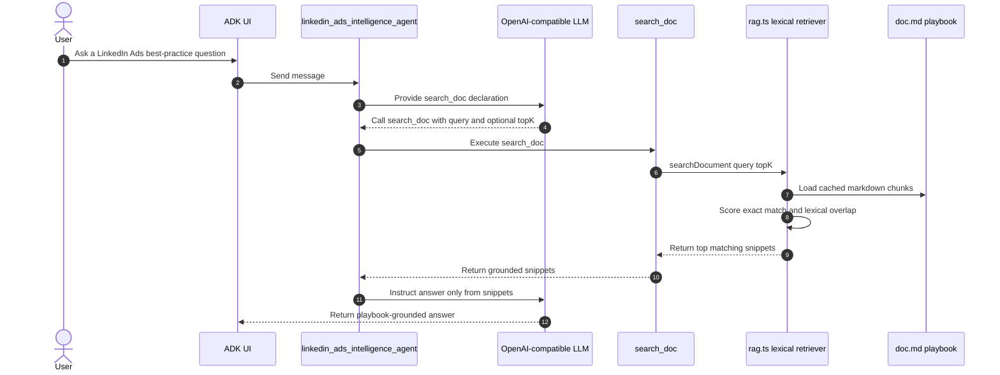
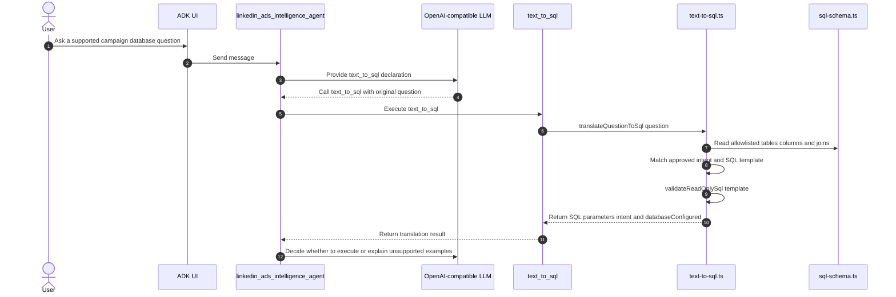
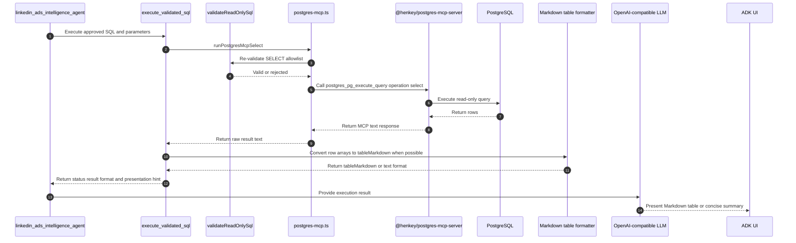

# LinkedIn Ads Campaign Agent

## Executive Summary & Business Impact

This project demonstrates how enterprise organizations can accelerate time-to-value by breaking down data silos between SaaS platforms such as LinkedIn Ads, internal playbooks, and secure CRM databases.

By bridging deep-technical constraints with C-suite business goals, this agent allows marketing executives to query ad ROI and lead generation in natural language, while providing IT teams with strict data sovereignty and secure governance through deterministic SQL validation.

This Google ADK TypeScript proof-of-concept demonstrates an Enterprise B2B Marketing AI Agent for LinkedIn Ads campaign intelligence. It helps campaign managers reason across volatile ad telemetry, a local LinkedIn Ads playbook, and CRM-backed PostgreSQL lead data without exposing arbitrary database access to the model.

## Capabilities

1. **Volatile Tool Calling** — `get_live_campaign_spend` and `get_audience_timezone` read local mock telemetry that represents LinkedIn Campaign Manager style data.
2. **Vectorless Lexical RAG** — `search_doc` retrieves grounded recommendations from `doc.md`, the LinkedIn B2B Advertising Playbook 2026.
3. **Deterministic Text-to-SQL** — `text_to_sql` maps supported campaign questions to audited SQL templates.
4. **Validated PostgreSQL MCP Bridge** — `execute_validated_sql` validates read-only SQL locally before sending safe queries to the internal PostgreSQL MCP bridge.

## Tech stack

- **Runtime and language:** Node.js ESM application written in strict TypeScript, targeting ES2022 with NodeNext module resolution.
- **Agent framework:** Built on the Google Agent Development Kit (ADK), showcasing alignment with Google's latest agentic primitives, typed `FunctionTool` declarations, and native support for the Model Context Protocol (MCP).
- **LLM adapter:** A local OpenAI-compatible Chat Completions adapter is configured with `LLM_API_URL`, `LLM_API_TOKEN`, `LLM_MODEL`, and optional `LLM_FALLBACK_MODEL`.
- **Local data and retrieval:** Mock campaign telemetry lives in `sample-data.ts`; the LinkedIn Ads playbook lives in `doc.md` and is searched by the dependency-free lexical retriever in `rag.ts`.
- **Database integration:** PostgreSQL campaign and lead data are reached through a guarded MCP bridge backed by `@henkey/postgres-mcp-server`; migration, seed, verify, and smoke scripts use the `pg` client.
- **Validation and safety:** `zod` defines tool input schemas, while `text-to-sql.ts` and `sql-schema.ts` enforce deterministic SQL templates and allowlisted read-only access.

## Package dependencies

These are the direct dependencies declared in `package.json`; `package-lock.json` records the resolved transitive dependency graph.

| Package | Type | Version range | Purpose |
| ------- | ---- | ------------- | ------- |
| `@google/adk` | Runtime | `latest` | Google ADK agent primitives, tool declarations, LLM base classes, and MCP toolset support. |
| `@henkey/postgres-mcp-server` | Runtime | `^1.0.7` | Stdio PostgreSQL MCP server used behind the validated database execution bridge. |
| `dotenv` | Runtime | `latest` | Loads local environment variables for LLM and database configuration. |
| `pg` | Runtime | `^8.22.0` | PostgreSQL client used by database migration, seed, verify, and setup scripts. |
| `zod` | Runtime | `latest` | Runtime schemas for ADK function tool parameters. |
| `@google/adk-devtools` | Development | `latest` | ADK development tooling used by the local run and web commands. |
| `@types/node` | Development | `latest` | TypeScript declarations for Node.js APIs. |
| `@types/pg` | Development | `^8.20.0` | TypeScript declarations for the PostgreSQL client. |
| `typescript` | Development | `latest` | TypeScript compiler and strict type checker. |

## Path to Production (Deployment Architecture)

While this repository serves as a local proof-of-concept, the architecture is designed for cloud-native enterprise deployment:

- **Compute:** The Node.js ADK application can be containerized and deployed to Google Cloud Run for serverless, auto-scaling execution.
- **Database:** The local PostgreSQL MCP bridge translates directly to Cloud SQL or AlloyDB, utilizing IAM database authentication.
- **Retrieval:** The local vectorless RAG can be swapped for Vertex AI Vector Search to scale from 100 playbook rules to millions of enterprise documents.
- **Models:** The OpenAI-compatible adapter ensures vendor flexibility, allowing seamless migration to Vertex AI Gemini 1.5 Pro/Flash utilizing Google's enterprise data privacy guarantees.

### Google Cloud Run deployment

The repository includes a `Dockerfile` for deploying the ADK web server to Cloud Run. The container listens on Cloud Run's `PORT` environment variable and runs the compiled ADK agent from `dist/agent.js`.

Enable the required APIs with full service names:

```bash
gcloud services enable \
  run.googleapis.com \
  cloudbuild.googleapis.com \
  artifactregistry.googleapis.com
```

Deploy from source:

```bash
gcloud run deploy lms-agent \
  --source . \
  --region us-central1 \
  --allow-unauthenticated \
  --min-instances=0 \
  --max-instances=1 \
  --memory=512Mi \
  --cpu=1 \
  --concurrency=80 \
  --timeout=300 \
  --no-cpu-boost \
  --set-env-vars NODE_ENV=production
```

This is the lowest-cost practical configuration for this PoC: Cloud Run scales to zero when idle, caps scaling at one instance, and uses a lower-cost/free-tier-friendly region.

Cloud Run does not read local `.env` files. Configure runtime environment variables through Cloud Run, Secret Manager, or the Google Cloud Console. At minimum, the app needs `LLM_API_URL` and `LLM_API_TOKEN` for live model calls; database-backed questions also need `DATABASE_URL`.

## Call flows

The ADK Web UI displays each user message, model decision, tool call, function response, and final answer as events. These diagrams show the four main paths through the agent.

### Tool calling: live campaign telemetry and audience timezone



### RAG: LinkedIn B2B Advertising Playbook



### Text-to-SQL: approved template selection



### MCP server: validated PostgreSQL execution



## RAG implementation

The `search_doc` tool uses a lightweight, vectorless lexical RAG implementation in `rag.ts`. It is intentionally local and dependency-free: no embedding model, vector database, external retrieval service, or Python sidecar is required.

The retrieval flow is:

1. Load `doc.md`, which contains the `# LinkedIn B2B Advertising Playbook 2026` corpus.
2. Split the markdown into paragraph-style chunks separated by blank lines.
3. Cache the chunks in memory for the lifetime of the Node.js process.
4. Normalize the user query and each chunk to lowercase.
5. Score each chunk by exact full-query containment plus per-term lexical overlap.
6. Extract Latin terms with `/[a-z0-9]+/g` and Chinese terms with Han-script matching plus 2- to 4-character n-grams.
7. Sort matching chunks by descending score and original document order.
8. Return up to `topK` snippets, clamped between 1 and 5, for the model to answer from.

The agent instruction requires the model to call `search_doc` for LinkedIn Ads best-practice questions and answer only from returned snippets. If no chunk matches, the agent should say the local LinkedIn Ads playbook does not contain enough information instead of guessing.

## Environment configuration

Copy `.env.example` to `.env` for local development, then fill in the required values. Keep `.env` local only; it contains secrets and must not be printed or committed.

```bash
cp .env.example .env
```

| Variable | Required | Used by | Description |
| -------- | -------- | ------- | ----------- |
| `DATABASE_URL` | Required for database scripts and PostgreSQL-backed questions | `db:*`, `smoke:text-sql`, `execute_validated_sql` | PostgreSQL connection string used by migration, seed, verify, smoke, and MCP-backed read-only SQL execution. Leave unset only when using non-database flows such as local telemetry or RAG. |
| `LLM_API_URL` | Yes | `adk:run`, `adk:web`, `smoke:llm-adapter` | Base URL for the OpenAI-compatible Chat Completions endpoint. |
| `LLM_API_TOKEN` | Yes | `adk:run`, `adk:web`, `smoke:llm-adapter` | Bearer token for the OpenAI-compatible LLM provider. |
| `LLM_MODEL` | Yes, defaults to `gpt-5-mini` in `.env.example` | `adk:run`, `adk:web`, `smoke:llm-adapter` | Primary model name sent to the configured OpenAI-compatible endpoint. |
| `LLM_BATCH_MODEL` | No | Reserved in `.env.example` | Batch-model placeholder included for provider compatibility; the current runtime does not read it. |
| `LLM_FALLBACK_MODEL` | No | `adk:run`, `adk:web`, `smoke:llm-adapter` | Optional fallback model used by the local LLM adapter when provider responses indicate the primary model should fall back. |

## Manual smoke prompts

```text
What is the live spend today for the "Q3 Cloud Migration - NA" campaign?
What is the target timezone for the "EMEA Executives" audience?
What are the 3 critical best practices for LinkedIn Lead Gen Forms?
How many active campaigns do we currently have running?
Which campaign has the highest allocated budget?
Which campaigns generated leads with the 'Director of IT' job title, and what are their company names?
list all campaigns from 1st to 200th record
```

## Validation

```bash
npm install
npm run typecheck
npm run smoke:local-data
npm run smoke:llm-adapter
npm run smoke:rag
npm run smoke:text-sql:translate
npm run db:setup
npm run smoke:text-sql
npm run adk:web
```

`npm run db:setup` and `npm run smoke:text-sql` require `DATABASE_URL` to be configured. See [Environment configuration](#environment-configuration) for all supported `.env.example` variables.

## License

This project is licensed under the Apache License 2.0. See [LICENSE](LICENSE) for details.

## Enterprise Governance & Data Sovereignty

A critical blocker for enterprise AI adoption is granting LLMs unrestricted database access. This architecture resolves that blocker by implementing strict data sovereignty guardrails that prevent data exfiltration and reduce LLM hallucinations:

- **Zero-Trust Database Access:** The LLM receives deterministic tools, not unrestricted PostgreSQL credentials.
- **Bridged Execution:** The raw PostgreSQL MCP query tool is isolated from the model.
- **Deterministic Validation:** SQL must be generated by `text_to_sql` and pass strict `validateReadOnlySql` checks. CTEs, mutations, DDL, SELECT INTO, non-allowlisted tables, and non-allowlisted columns are rejected locally before MCP execution.
- `.env` is ignored by Git and should never be printed or committed.

## Approved SQL templates and allowlists

The agent does not execute arbitrary user-authored SQL. Database-backed questions must route through one of the approved `text_to_sql` intents below, then pass `validateReadOnlySql` before `execute_validated_sql` forwards the query to the PostgreSQL MCP bridge.

| Intent                    | Example prompt                                                                                           | Approved SQL template                                                                                                                                                                                                                                                                       |
| ------------------------- | -------------------------------------------------------------------------------------------------------- | ------------------------------------------------------------------------------------------------------------------------------------------------------------------------------------------------------------------------------------------------------------------------------------------- |
| `campaign_count`          | `How many active campaigns do we currently have running?`                                                | `SELECT COUNT(*) AS active_campaigns FROM public.campaign WHERE status = 'ACTIVE'`                                                                                                                                                                                                          |
| `highest_budget_campaign` | `Which campaign has the highest allocated budget?`                                                       | `SELECT id, name, budget FROM public.campaign WHERE budget = (SELECT MAX(budget) FROM public.campaign) ORDER BY id`                                                                                                                                                                         |
| `leads_by_job_title`      | `Which campaigns generated leads with the 'Director of IT' job title, and what are their company names?` | `SELECT c.name AS campaign_name, l.job_title, l.company_name, clm.cost_per_lead FROM public.campaign AS c JOIN public.campaign_lead_map AS clm ON clm.campaign_id = c.id JOIN public.lead_event AS l ON l.id = clm.lead_event_id WHERE l.job_title ILIKE $1 ORDER BY clm.cost_per_lead ASC` |
| `campaign_list`           | `list all campaigns from 1st to 200th record`                                                            | `SELECT id, name, objective, budget, status FROM public.campaign ORDER BY id LIMIT 200`                                                                                                                                                                                                     |

The allowlisted tables and columns are:

| Table                      | Allowed columns                                      |
| -------------------------- | ---------------------------------------------------- |
| `public.campaign`          | `id`, `name`, `objective`, `budget`, `status`        |
| `public.lead_event`        | `id`, `job_title`, `company_name`, `conversion_date` |
| `public.campaign_lead_map` | `campaign_id`, `lead_event_id`, `cost_per_lead`      |

The only approved join patterns are:

| From                       | To                         | Join condition                                    |
| -------------------------- | -------------------------- | ------------------------------------------------- |
| `public.campaign`          | `public.campaign_lead_map` | `campaign_lead_map.campaign_id = campaign.id`     |
| `public.campaign_lead_map` | `public.lead_event`        | `lead_event.id = campaign_lead_map.lead_event_id` |

`validateReadOnlySql` also rejects empty SQL, non-`SELECT` statements, `WITH` queries, semicolon-separated multi-statements, write/admin keywords, non-allowlisted tables, non-allowlisted aliased columns, and unaliased columns in multi-table joins.
